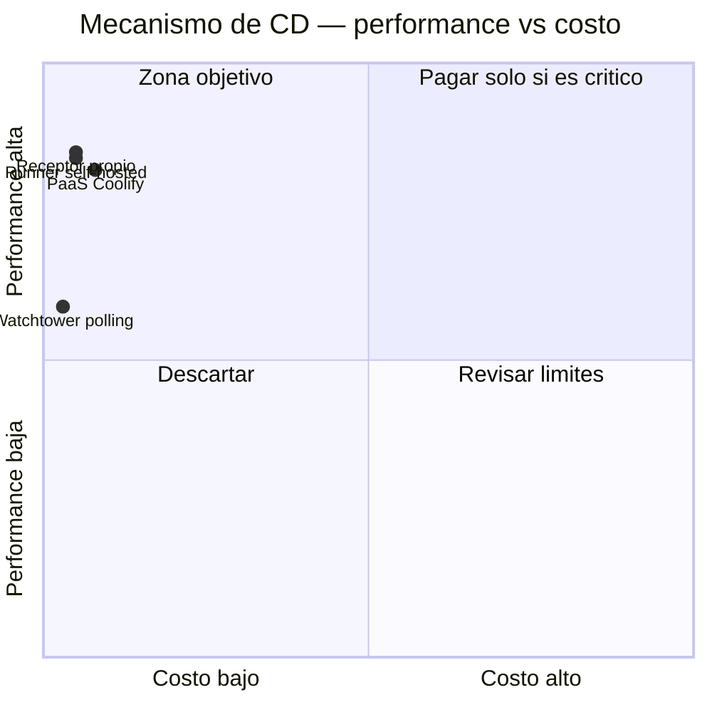

# ADR-0006: Placement de despliegue — mecanismo de CD, registro de imágenes y plataforma de build

* **Estado:** accepted
* **Fecha:** 2026-08-30
* **Decisores:** Jeremi Alcala
* **Fase AI-DLC:** 02-design
* **Versión:** 1.0.0
* **ID:** ADR-0006
* **Supersede / Superseded-by:** —
* **Controles OWASP afectados:** A03 (cadena de suministro de software), A02 (configuración)

> Nota de ubicación: la guía de deployment placement propone
> `docs/02-design/adr/ADR-NNN-placement-<componente>.md`. Este repositorio mantiene un **único
> registro de ADRs** en `docs/00-project/adr/` para no fragmentar la numeración (ADR-0001). El
> contenido sigue la plantilla de la guía sin cambios.

## Contexto

Hay **tres componentes desplegables** con decisiones de placement distintas.

### Componente 1 — El receptor de despliegue

**Clasificación: perfil E (especial), por restricción de localidad absoluta.** Su trabajo es
manipular el daemon de Docker de un host concreto. No puede vivir en otro sitio: ejecutarlo en
una nube exigiría abrir la API de Docker del servidor a Internet, que es exactamente lo que el
sistema existe para evitar (ADR-0004).

El placement geográfico, por tanto, **no se decide: viene dado**. Lo que sí es una decisión
real, y con varios candidatos viables, es **qué mecanismo** ocupa ese hueco.

### Componente 2 — El registro de imágenes

Perfil A (almacenamiento estático servido por HTTPS). Aquí sí hay competencia real y costes que
divergen.

### Componente 3 — La plataforma de build

Perfil D (trabajo por lotes bajo demanda). El repositorio es **público**, lo que cambia
radicalmente la aritmética.

### Tráfico estimado a 12 meses

Parque de Higerotech: en torno a 5 aplicaciones desplegables, con una media generosa de
**150 despliegues/mes**. Cada `pull` transfiere sobre todo capas nuevas (~50 MB efectivos tras
caché), con imágenes completas de ~200 MB y un histórico de unas 30 imágenes por aplicación.
Redondeando al alza: **~10 GB/mes de transferencia y ~6 GB de almacenamiento**. Volumen
irrelevante para cualquier proveedor; lo que decide no es el precio, sino los límites y el
acoplamiento.

## Componente 1 — Candidatos para el mecanismo de CD

| Criterio (peso) | Receptor propio (elegido) | Runner self-hosted de Actions | PaaS self-hosted (Coolify) | Watchtower / polling |
|---|---|---|---|---|
| Latencia build→producción (30%) | 5 | 4 | 5 | 2 |
| Escalabilidad sin intervención (20%) | 4 | 4 | 5 | 3 |
| Cold start / SLA (15%) | 5 | 3 | 4 | 3 |
| Límites técnicos (15%) | 4 | 5 | 3 | 2 |
| Carga operativa (20%) | 3 | 5 | 3 | 5 |
| **Score_perf** | **4.25** | **4.20** | **4.10** | **2.95** |
| **Costo est. USD/mes** | **$0** | **$0** | **$0** | **$0** |
| **PxD** | **42.5** | **42.0** | **41.0** | **29.5** |

Los cuatro cuestan **$0/mes**: todos corren sobre hardware ya pagado. Con el costo normalizado
a 1 USD, el PxD queda dominado por `Score_perf`, y los tres primeros caen dentro de un **3,7 %**
de diferencia — por debajo del umbral del 15 % que la guía define como empate.

Aplicando el **criterio de desempate documentado (menor carga operativa)** ganaría el runner
self-hosted, no el receptor propio. La decisión se aparta del desempate por un motivo que la
matriz no captura y que conviene dejar escrito:

> **El repositorio es público.** Un runner self-hosted clona y ejecuta el contenido del
> repositorio en el servidor; en un repositorio público, cualquiera puede abrir un pull request
> y conseguir ejecución de código arbitrario en la máquina. GitHub lo desaconseja
> explícitamente para repositorios públicos. El receptor propio nunca ejecuta código del
> repositorio: solo lee un SHA de un payload firmado y hace `pull` de una imagen ya construida.

Es decir: el desempate por carga operativa se descarta porque el candidato ganador **no es
admisible** bajo la restricción de visibilidad del charter, no porque puntúe peor.

*Eje trazabilidad — fase 02-design. Los cuatro caen en la zona objetivo por costo; lo que separa
al elegido es la admisibilidad en repositorio público, no la puntuación.*

## Componente 2 — Candidatos para el registro de imágenes

| Criterio (peso) | GHCR (elegido) | Docker Hub | Amazon ECR |
|---|---|---|---|
| Latencia percibida (30%) | 5 | 4 | 4 |
| Escalabilidad sin intervención (20%) | 5 | 3 | 5 |
| Cold start / SLA (15%) | 5 | 4 | 5 |
| Límites técnicos (15%) | 5 | 2 | 5 |
| Carga operativa (20%) | 5 | 4 | 2 |
| **Score_perf** | **5.00** | **3.45** | **4.15** |
| **Costo est. USD/mes** | **$0** | **$0** | **~$1.50** |
| **PxD** | **50.0** | **34.5** | **27.7** |

GHCR gana por margen amplio (45 % sobre el segundo), muy por encima del umbral de empate. Tres
razones concretas:

1. **La imagen vive donde vive el código y su historial.** El tag `sha-1a2b3c4` es trazable a
   un commit del mismo repositorio sin cruzar sistemas (refuerza ADR-0003).
2. **Sin límites de descarga que degraden un despliegue.** El plan gratuito de Docker Hub
   limita a 200 `pull` por ventana de 6 h autenticado y 10/h anónimo; a 150 despliegues/mes no
   es vinculante hoy, pero convierte un pico de reintentos en un `429` en el peor momento.
3. **Autenticación resuelta.** El `GITHUB_TOKEN` del workflow ya publica en GHCR sin gestionar
   credenciales; al ser público, el `pull` desde el servidor es anónimo y no requiere
   `docker login` (ver `data-classification.md`).

### Costos: fuentes verificadas el 2026-08-30

| Servicio | Precio aplicable a este componente | Fuente |
|---|---|---|
| GHCR / GitHub Packages | **$0** — "GitHub Packages usage is free for public packages"; el almacenamiento y ancho de banda del Container registry son gratuitos actualmente | [About billing for GitHub Packages](https://docs.github.com/en/billing/managing-billing-for-your-products/managing-billing-for-github-packages/about-billing-for-github-packages) |
| GitHub Actions | **$0** — ilimitado en repositorios públicos. En privado: 2.000 min Linux/mes y $0,006/min tras el recorte de hasta el 39 % del 2026-01-01 | [GitHub Changelog, 2025-12-16](https://github.blog/changelog/2025-12-16-coming-soon-simpler-pricing-and-a-better-experience-for-github-actions/) · [Pricing changes for GitHub Actions](https://github.com/resources/insights/2026-pricing-changes-for-github-actions) |
| Runners self-hosted | **$0** — el cargo de $0,002/min anunciado para el 2026-03-01 se pospuso y **nunca entró en vigor** | [Pricing changes for GitHub Actions](https://github.com/resources/insights/2026-pricing-changes-for-github-actions) |
| Docker Hub (Personal, gratuito) | $0, con **200 `pull`/6 h autenticado** y 10/h anónimo | [Docker Hub free tier 2026](https://agentdeals.dev/vendor/docker-hub) |
| Amazon ECR (privado) | $0,10/GB/mes de almacenamiento → 6 GB ≈ **$0,60/mes**; capa gratuita de 500 MB solo el primer año | [Amazon ECR pricing](https://aws.amazon.com/ecr/pricing/) |
| Transferencia de salida de AWS a Internet | ~$0,09/GB en la tarifa estándar → 10 GB ≈ **$0,90/mes**. *La página de ECR no detalla la tarifa; se usa el tramo estándar de salida a Internet, marcado como estimación.* | [Amazon ECR pricing](https://aws.amazon.com/ecr/pricing/) |
| Cloudflare Tunnel | **$0** — sin límites de uso; Zero Trust gratuito hasta 50 usuarios | [Cloudflare Zero Trust pricing 2026](https://costbench.com/software/business-vpn/cloudflare-zero-trust/) |

## Componente 3 — Plataforma de build

**GitHub Actions, sin matriz.** La guía permite documentar sin matriz cuando el candidato es
claro y el costo es inferior al de la propia documentación: al ser el repositorio público,
Actions es **gratuito e ilimitado**, ya está donde vive el código y emite de forma nativa el
evento `workflow_run` que dispara el despliegue (ADR-0002). Cualquier alternativa añadiría un
sistema y un coste para obtener menos.

CodePipeline + CodeBuild solo se justificaría por un requisito IAM o de cumplimiento que
obligara a que el CD no saliera de AWS. No es el caso, y "por consistencia" no es una razón.

## Decisión

| Componente | Placement | Motivo dominante |
|---|---|---|
| Receptor de despliegue | **On-prem**, en el host destino, como servicio systemd | Restricción de localidad; único mecanismo admisible en repositorio público |
| Registro de imágenes | **GHCR** (`ghcr.io/higerotech/<app>`) | Trazabilidad con el código, sin límites de `pull`, $0 |
| Plataforma de build | **GitHub Actions** | Gratuito e ilimitado en público; emite `workflow_run` de forma nativa |

## Consecuencias

- Positivas: el coste recurrente de la cadena completa es **$0/mes**. No hay proveedor cloud en
  la ruta crítica del despliegue más allá de GitHub y Cloudflare, ambos ya en uso.
- Negativas / deuda asumida: se acepta más carga operativa que con un runner self-hosted (hay
  que mantener el receptor, unas 800 líneas de Python). Es el precio de la admisibilidad en
  repositorio público. Dependencia de GitHub en dos puntos —build y registro—: si GitHub cae,
  no hay despliegues nuevos, aunque lo desplegado sigue corriendo.
- **Condiciones de revisión:**
  - Si el repositorio pasara a **privado**, el runner self-hosted vuelve a ser admisible y gana
    el desempate por carga operativa: esta ADR debería revisarse.
  - Si GHCR dejara de ser gratuito para paquetes públicos (GitHub se compromete a avisar con
    antelación), rehacer la matriz del componente 2.
  - Si el tráfico se multiplicara por 10 (1.500 despliegues/mes), reevaluar retención de
    imágenes y coste de almacenamiento.
  - Precios con caducidad: **revisar antes del 2027-02-28** (6 meses).
