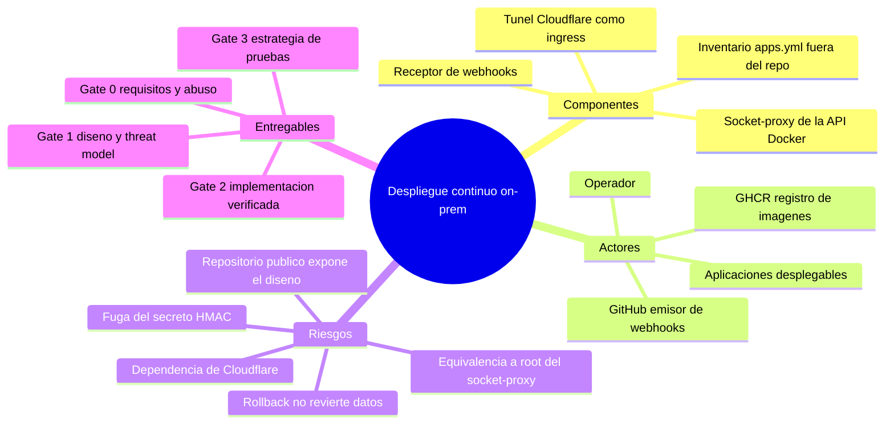

# Project Charter — despliegue-continuo

* **Estado:** approved
* **Fecha:** 2026-08-30
* **Decisores:** Jeremi Alcala
* **Fase AI-DLC:** 00-project
* **Versión:** 0.1.0
* **Sponsor:** Jeremi Alcala
* **Owner del proyecto:** Jeremi Alcala

## Visión

Desplegar automáticamente las aplicaciones de Higerotech en un servidor Linux propio cada vez
que su código pasa la build en GitHub, **sin abrir un solo puerto en el router** y sin que el
servidor confíe en nada que no venga firmado. El disparo lo da un webhook de GitHub; la
ejecución la hace un receptor propio, pequeño y auditable, que despliega el commit exacto y
revierte solo si el servicio no responde.

## Alcance

- Incluye:
  - El **receptor de webhooks** (`receiver/`): validación HMAC, emparejamiento contra
    inventario, cola de despliegues, healthcheck y rollback automático.
  - El **socket-proxy** de la API de Docker que evita que el usuario de servicio pertenezca al
    grupo `docker` (ADR-0005).
  - El diseño del **ingress único** por túnel de Cloudflare, publicando solo `/webhook`.
  - Las **plantillas** para el repositorio de cada aplicación desplegable: workflow de build
    hacia GHCR y `docker-compose.yml` con tag inmutable.
  - El **instalador** idempotente para el servidor (`deploy/install.sh`) y la unidad systemd
    endurecida.
  - Documentación AI-DLC hasta **Gate 3**: requisitos con escenarios de abuso, threat model
    STRIDE/DREAD, ADRs, contrato de interfaces, runbook y estrategia de pruebas.
- **No incluye (no-scope):**
  - Despliegue a **más de un servidor** desde un mismo receptor (una instancia por host).
  - **Migraciones de base de datos** de las aplicaciones desplegadas: el rollback restaura el
    contenedor, nunca los datos.
  - **Despliegue sin cortes** (blue/green, canary): `docker compose up -d` recrea el contenedor
    y hay segundos de indisponibilidad.
  - **Observabilidad centralizada** de los despliegues (Gates 4 y 5, fuera de este corte).
  - La construcción de las aplicaciones en el servidor: el build vive en GitHub Actions.

## Mapa mental del alcance

*Eje trazabilidad — fase 00-project.*

## Stakeholders

| Rol | Nombre | Responsabilidad |
|---|---|---|
| Sponsor / Owner / Operador | Jeremi Alcala | Alcance, cierre de gates, custodia del secreto y del inventario |
| Repositorios de aplicaciones | Proyectos de Higerotech | Publicar imagen en GHCR y exponer un endpoint de salud |
| GitHub | Externo | Emisión firmada de webhooks y ejecución de la build |
| Cloudflare | Externo | Terminación TLS y transporte del túnel hasta el host |

## Restricciones y supuestos

- El servidor destino es un **Linux aparte** con Docker y systemd, sin IP pública utilizable.
- Ya existe una cuenta de Cloudflare con dominio gestionado; el hostname concreto del túnel
  **no se versiona** porque este repositorio es público (ver `data-classification.md`).
- El repositorio vive en `github.com/higerotech/despliegue-continuo` y es **público**: GitHub
  Actions y GHCR resultan gratuitos, y a cambio el diseño completo es conocido por cualquiera.
- La máquina de trabajo del operador es Windows; el receptor corre en el host Linux.
- Cada aplicación desplegable expone un endpoint de salud. Sin él no hay verificación real y
  el rollback automático pierde su disparador.

## Métricas de éxito del proyecto

| Métrica | Objetivo | Cómo se mide |
|---|---|---|
| Latencia build→producción | < 3 min desde `workflow_run` completado | `seconds` en `/var/log/cd-receiver/<app>.jsonl` |
| Despliegues que requieren intervención manual | < 5 % | Proporción de entradas con `ok: false` y `rolled_back: false` |
| Rollbacks que restauran el servicio | 100 % de los intentos | `rolled_back: true` con healthcheck posterior correcto |
| Puertos abiertos hacia Internet en el host | 0 | `ss -ltnp` en el servidor |
| Webhooks no firmados que llegan a desplegar | 0 | Respuestas `401` en el log del receptor |

## Riesgos de alto nivel

| Riesgo | Impacto | Mitigación |
|---|---|---|
| Fuga del secreto HMAC | Despliegue arbitrario de cualquier tag existente | Fichero `0600` root:root, rotación documentada, fuera del repo |
| Equivalencia a root del acceso a Docker | Compromiso total del host | Socket-proxy con superficie recortada (ADR-0005); rootless como evolución |
| Repositorio público | El atacante conoce endpoints y lógica de validación | La seguridad recae en el secreto, no en el secreto del diseño; hostname e inventario nunca se versionan |
| Caída de Cloudflare | No llegan webhooks; los despliegues se paran | Degradación benigna: nada se rompe, se despliega a mano con `IMAGE_TAG` |
| Rollback que no revierte migraciones | Datos inconsistentes tras revertir | No-scope declarado; las apps con migraciones deben diseñarlas compatibles hacia atrás |
