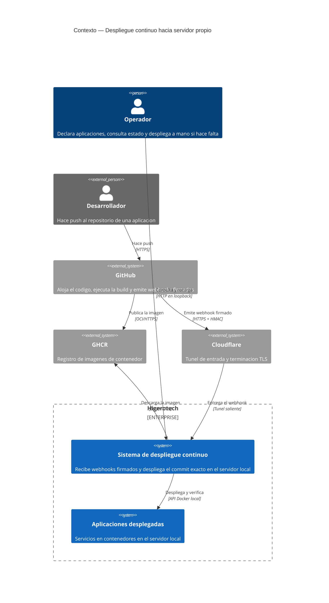
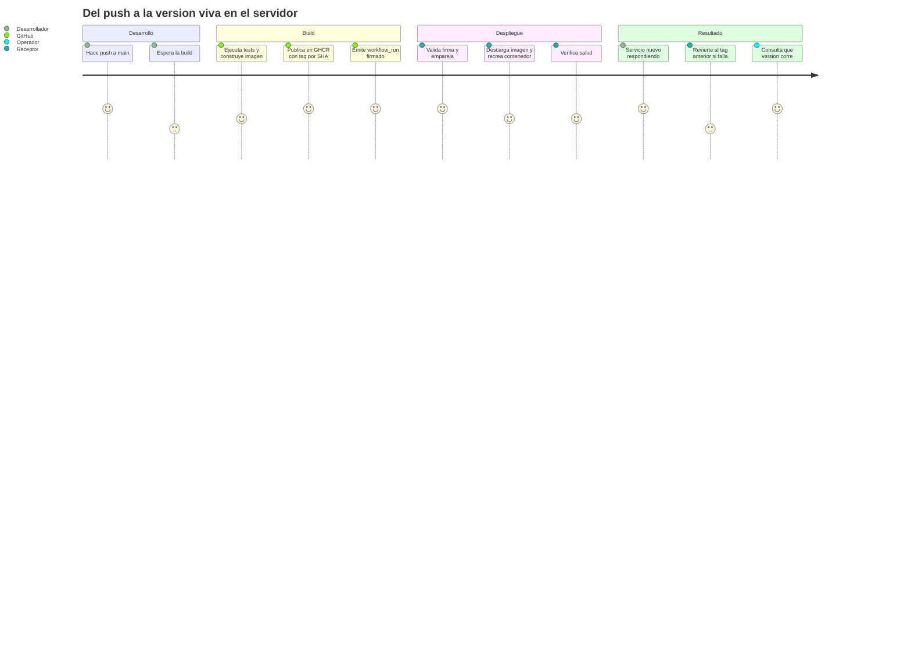
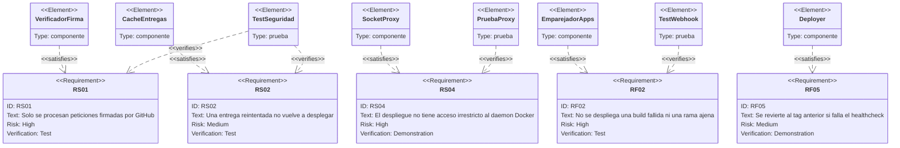
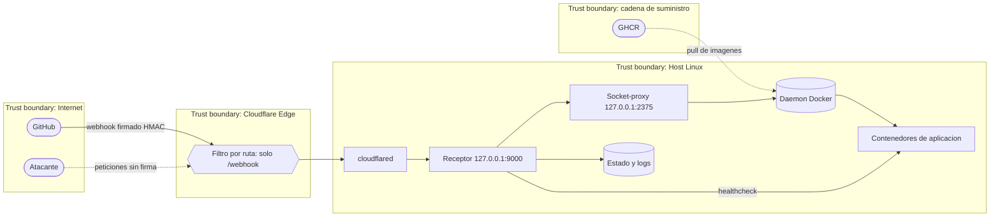
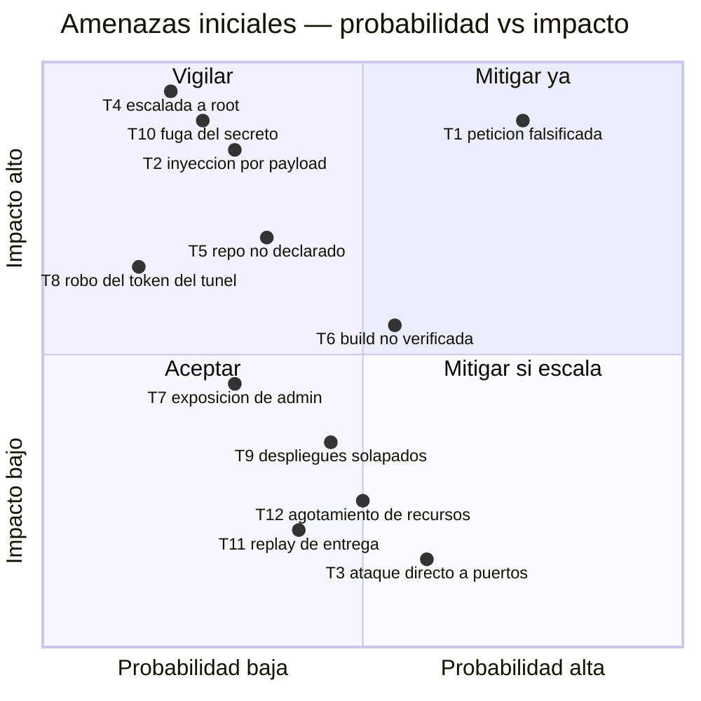

# PRD — Despliegue continuo disparado por webhook firmado

* **Estado:** approved
* **Fecha:** 2026-08-30
* **Decisores:** Jeremi Alcala
* **Fase AI-DLC:** 01-requirements
* **Versión:** 0.1.0
* **Gate:** 0
* **Feature ID:** FEAT-001
* **ASVS (capítulos de referencia):** V2 (autenticación de servicio a servicio) · V4 (control de acceso) · V5 (validación de entrada) · V7 (registro y manejo de errores) · V14 (configuración)

## Problema

Desplegar a mano una aplicación en el servidor propio son cuatro pasos (`pull`, `up`,
comprobar, revertir si falla) que se ejecutan tarde, se olvidan y no dejan rastro de qué
versión quedó viva. Automatizarlo con las herramientas habituales exige abrir un puerto al
servidor o dar a un runner permiso para ejecutar código del repositorio — ambas cosas
inaceptables aquí (charter, ADR-0006).

## Usuarios y contexto

*Eje estructura — fase 01-requirements. Ningún flujo entra al sistema salvo por Cloudflare.*

## Recorrido del usuario

*Eje trazabilidad — fase 01-requirements. La puntuación baja del rollback es deliberada: es
correcto que ocurra, pero significa que algo salió mal.*

## Requisitos funcionales

| ID | Requisito | Verificación |
|---|---|---|
| **RF01** | Al completarse con éxito el workflow de build de una aplicación declarada, el sistema despliega el commit correspondiente sin intervención humana | `test_webhook.py::test_encola_el_despliegue_cuando_todo_encaja` |
| **RF02** | El sistema **no** despliega si la build falló, si la rama no es la desplegable o si el workflow no es el declarado | `test_events.py::test_no_despliega_si_el_workflow_no_tuvo_exito`, `test_webhook.py::test_ignora_lo_que_no_esta_declarado` |
| **RF03** | El despliegue usa un tag inmutable derivado del SHA del commit, nunca una etiqueta móvil | `test_config.py::test_calcula_el_tag_desde_el_sha` |
| **RF04** | Solo se despliegan aplicaciones declaradas en el inventario | `test_webhook.py::test_ignora_lo_que_no_esta_declarado` |
| **RF05** | Si el servicio desplegado no supera el healthcheck, el sistema restaura automáticamente el tag anterior | Verificación manual en Gate 3 (ver `docs/04-testing/test-strategy.md`, deuda D-01) |
| **RF06** | Cuando un evento legítimo no dispara despliegue, la respuesta indica el motivo concreto | `test_webhook.py::test_ignora_lo_que_no_esta_declarado` (verifica el cuerpo) |
| **RF07** | El inventario se recarga sin reiniciar el servicio ni interrumpir despliegues en curso | Verificado en humo: `POST /reload` → `{"status":"reloaded"}` |
| **RF08** | El operador puede consultar qué versión corre, qué hay en cola y el histórico reciente | Verificado en humo: `GET /status` |

## Requisitos no funcionales

| ID | Requisito | Umbral | Verificación |
|---|---|---|---|
| **RNF01** | Ningún puerto del servidor escucha en una interfaz pública | 0 puertos | `ss -ltnp` en el host; `test_config.py::test_escucha_en_loopback_por_defecto` |
| **RNF02** | Un despliegue es reproducible: dado un SHA, se puede reconstruir qué se desplegó | 100 % | Tag por SHA + estado en `/var/lib/cd-receiver/` |
| **RNF03** | El webhook se responde antes del timeout de GitHub | < 10 s (real: milisegundos) | Encolado, no ejecución en la petición (ADR-0008) |
| **RNF04** | Dos despliegues de la misma aplicación nunca se solapan | 0 solapes | Un worker por app (`queue.DeployQueue`) |

## Requisitos de seguridad

| ID | Requisito | OWASP 2025 | Verificación |
|---|---|---|---|
| **RS01** | Solo se procesan peticiones cuya firma HMAC-SHA256 valide contra el secreto compartido | A07, A04 | `test_security.py` (6 casos), `test_webhook.py::test_rechaza_una_firma_de_otro_secreto` |
| **RS02** | Una entrega reintentada o reenviada no vuelve a desplegar | A08 | `test_security.py::TestDeliveryCache`, `test_webhook.py::test_la_reentrega_...` |
| **RS03** | Ningún valor del payload se convierte en ruta del sistema de ficheros ni en comando de shell | A05 | Revisión de `deployer._run` (exec sin shell) + ADR-0007 |
| **RS04** | El proceso que despliega no dispone de acceso irrestricto al daemon de Docker | A01, A06 | ADR-0005; verificado: `exec` y `system` devuelven `403` |
| **RS05** | Ningún secreto ni dato específico de la instalación llega al repositorio | A02 | `git ls-files` no lista `.env` ni `config/apps.yml` |
| **RS06** | Los endpoints de administración no son alcanzables desde Internet | A01 | Filtro por ruta en el túnel + guardia loopback/token en `main._authorized` |

## Trazabilidad requisito → control → prueba

*Eje trazabilidad — fase 01-requirements. RF05 aparece sin prueba automática: es la deuda D-01
del Gate 3.*

## Escenarios de abuso

Cada uno es una historia de un atacante, no una lista de controles.

| ID | Escenario | Resultado esperado del sistema |
|---|---|---|
| **AB-01** | Alguien descubre el hostname del túnel (o lo encuentra escaneando certificados) y envía un `POST /webhook` con un payload válido copiado de la documentación pública | `401 firma invalida`. Sin el secreto, el payload es inútil. El repositorio es público y el atacante conoce el formato exacto: **da igual**. |
| **AB-02** | Un colaborador con acceso de escritura al repositorio de una aplicación intenta desplegar desde una rama distinta de `main` | `202 ignored: rama 'X' distinta de la desplegable ('main')`. Nada se despliega. |
| **AB-03** | Un atacante consigue una entrega firmada legítima (por ejemplo de un log) y la reenvía repetidamente | La primera se procesa; el resto: `202 ignored: delivery ... ya procesado`. Y aunque pasara la caché, redesplegaría **el mismo SHA**: es idempotente. |
| **AB-04** | Se manipula el payload para que `repository.full_name` apunte a `../../etc` o a un repositorio ajeno | La firma deja de validar al tocar el cuerpo (`401`). Si el atacante tuviera el secreto, el repo no estaría en el inventario: `202 ignored`. La cadena nunca se usa como ruta. |
| **AB-05** | Un pull request malicioso en el repositorio público intenta ejecutar código en el servidor | No hay runner self-hosted (ADR-0006). El servidor nunca ejecuta código del repositorio: solo descarga una imagen ya construida. |
| **AB-06** | Se abre un PR que modifica el workflow para publicar una imagen con puerta trasera | El evento `workflow_run` de un PR no tiene `head_branch: main`: `202 ignored`. Solo `main` despliega, y `main` está protegida por la revisión del repositorio. |
| **AB-07** | Alguien intenta leer el inventario o forzar una recarga desde Internet | El túnel solo publica `^/webhook$`: `404` en el borde. Aunque llegara, `main._authorized` exige loopback o token. |
| **AB-08** | Envío de un cuerpo de 500 MB para agotar la memoria del receptor | `413 payload demasiado grande` por encima de 1 MiB, antes de parsear nada. |
| **AB-09** | Compromiso del propio receptor por una vulnerabilidad en una dependencia | **Parcialmente mitigado.** El socket-proxy estrecha el camino, pero conserva `POST /containers/create`: el atacante aún puede escalar a root del host. Ver ADR-0005 y T4. |

## Evaluación inicial de amenazas

*Eje comportamiento — fase 01-requirements. Insumo del STRIDE de fase 02. El tráfico no firmado
muere en el receptor; el no dirigido a `/webhook`, en el borde.*

### Priorización DREAD inicial

*Eje trazabilidad — fase 01-requirements. Posiciones **antes** de aplicar controles; el análisis
STRIDE completo y el residual están en `docs/02-design/threat-model.md`.*

## Fuera de alcance

- Despliegue a más de un servidor desde un mismo receptor.
- Migraciones de base de datos y su reversión.
- Despliegue sin cortes de servicio.
- Notificación del resultado del despliegue a un canal externo (candidato a Gate 4).
