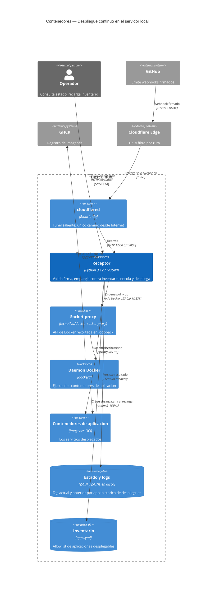
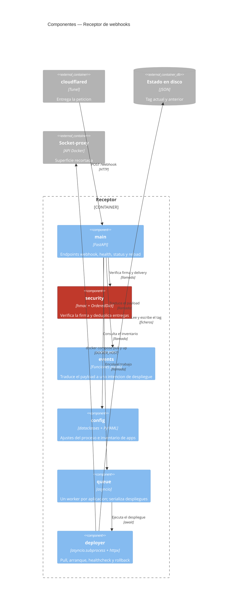
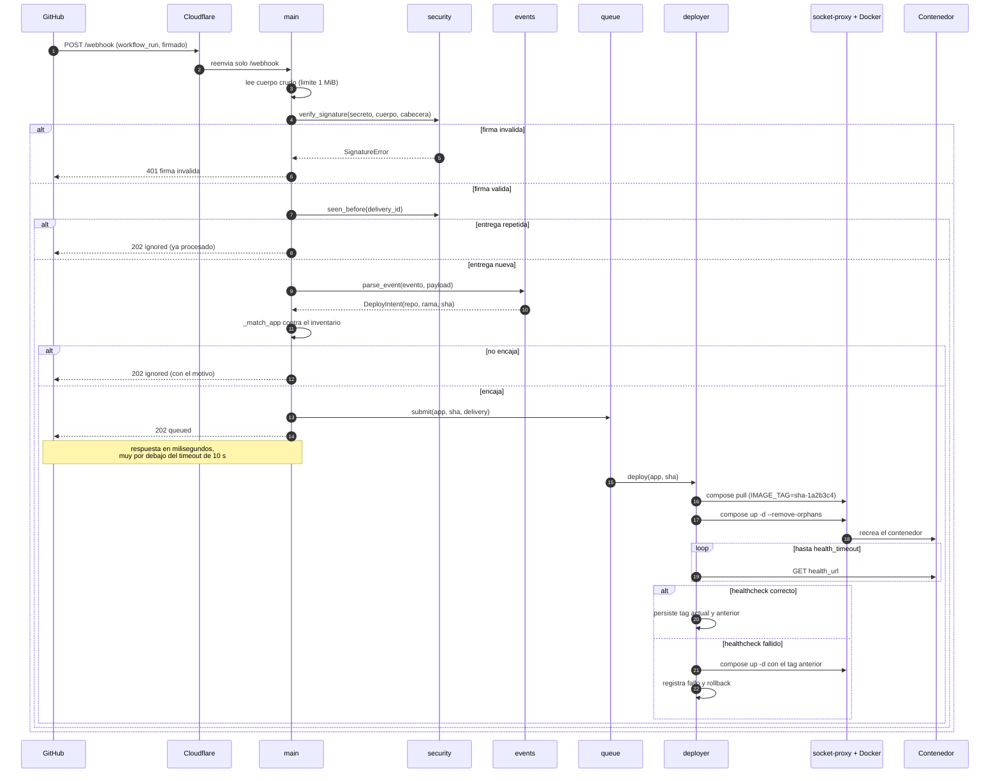
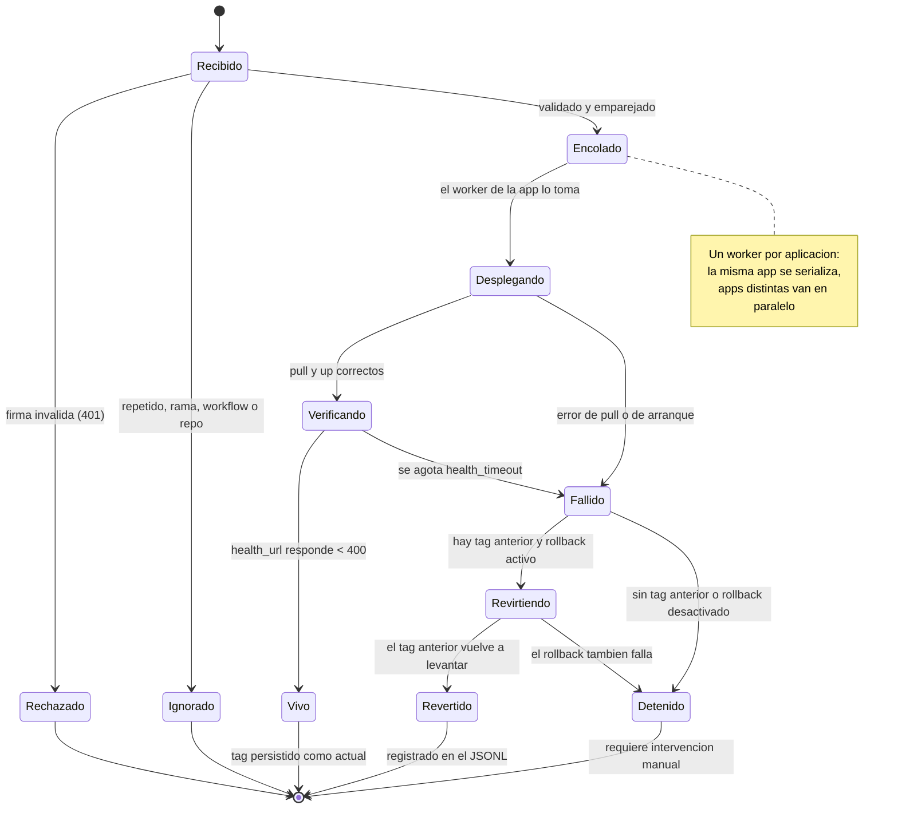
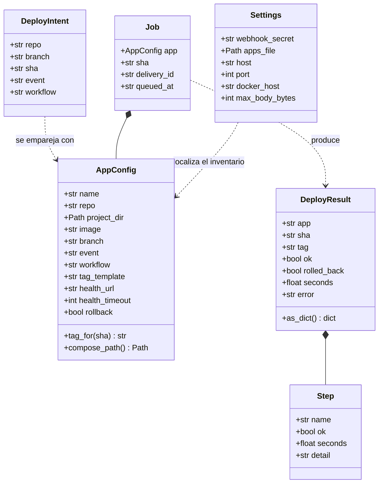

# Arquitectura — Sistema de despliegue continuo

* **Estado:** approved
* **Fecha:** 2026-08-30
* **Decisores:** Jeremi Alcala
* **Fase AI-DLC:** 02-design
* **Versión:** 0.2.0
* **Gate:** 1
* **Estilo arquitectónico:** Clean Architecture ligera — el dominio (validar, emparejar,
  desplegar) no depende de FastAPI ni de Docker; ambos son detalles en los bordes.

## Principio rector

El sistema tiene **una sola frontera de confianza que importa**: la firma HMAC. Todo lo que la
cruza sin validarse es hostil; todo lo que la cruza validado se trata como una instrucción de
una fuente conocida, pero **aun así jamás se convierte en ruta ni en comando** (ADR-0007).

Consecuencia de diseño: la validación es lo primero que ocurre y es puramente funcional —
`security.verify_signature` no sabe qué es un despliegue, y `deployer.Deployer` no sabe qué es
un webhook.

## Contenedores

*Eje estructura — fase 02-design. El socket-proxy es el único que toca el daemon; el receptor
nunca ve `/var/run/docker.sock`.*

## Componentes internos del receptor

*Eje estructura — fase 02-design. `security` en rojo: es el único componente cuya corrección
sostiene todo el modelo de confianza.*

## Flujo crítico: del webhook a la versión viva

*Eje comportamiento — fase 02-design. La respuesta a GitHub se emite **antes** de desplegar
(ADR-0008): el resultado no viaja de vuelta, y esa es la deuda conocida del diseño.*

## Ciclo de vida de un despliegue

*Eje comportamiento — fase 02-design. `Detenido` es el único estado que exige a una persona.*

## Modelo de datos del dominio

*Eje estructura — fase 02-design. `DeployIntent` es inmutable y desacopla el formato de GitHub
del resto: si GitHub cambia el payload, solo `events.py` se toca.*

## Decisiones que sostienen esta arquitectura

| Decisión | ADR |
|---|---|
| `workflow_run` como disparador, no `push` | [ADR-0002](../00-project/adr/0002-disparador-workflow-run.md) |
| Tag inmutable por SHA y rollback al anterior | [ADR-0003](../00-project/adr/0003-tag-inmutable-por-sha.md) |
| Túnel de Cloudflare como único ingress | [ADR-0004](../00-project/adr/0004-cloudflare-tunnel-unico-ingress.md) |
| Socket-proxy en lugar del grupo `docker` | [ADR-0005](../00-project/adr/0005-socket-proxy-en-lugar-de-grupo-docker.md) |
| Placement: on-prem, GHCR y GitHub Actions | [ADR-0006](../00-project/adr/0006-placement-mecanismo-cd-y-registro.md) |
| El inventario es la allowlist, fuera del repo | [ADR-0007](../00-project/adr/0007-inventario-como-allowlist.md) |
| Encolar y responder `202` con motivo | [ADR-0008](../00-project/adr/0008-cola-por-app-y-respuesta-202.md) |

## Límites conocidos de la arquitectura

| Límite | Consecuencia | Salida si deja de ser aceptable |
|---|---|---|
| Un receptor por servidor | No hay despliegue multi-host coordinado | Declarar el webhook en varios destinos, o un orquestador por encima |
| El resultado no vuelve a GitHub | La entrega figura correcta aunque el despliegue falle | Notificaciones desde `queue._record` (Gate 4) |
| Sin despliegue sin cortes | Segundos de indisponibilidad al recrear | Proxy delante con dos réplicas |
| El rollback no revierte datos | Una migración aplicada permanece | Migraciones compatibles hacia atrás en cada app |
| El `.jsonl` no rota | Crecimiento sin límite del log | `logrotate` o rotación en `_append_log` (Gate 4) |
