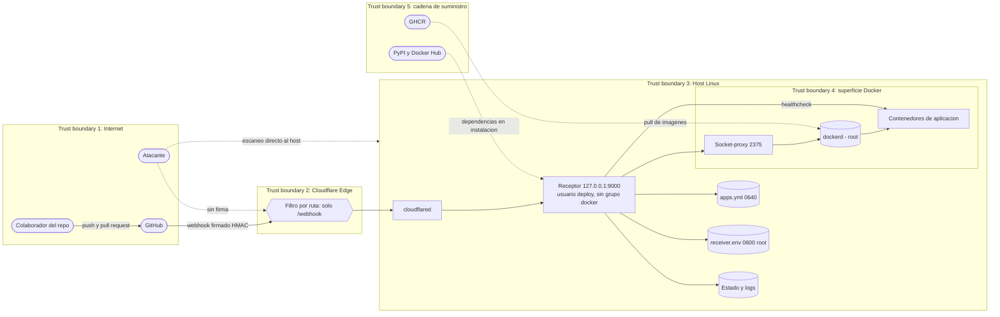
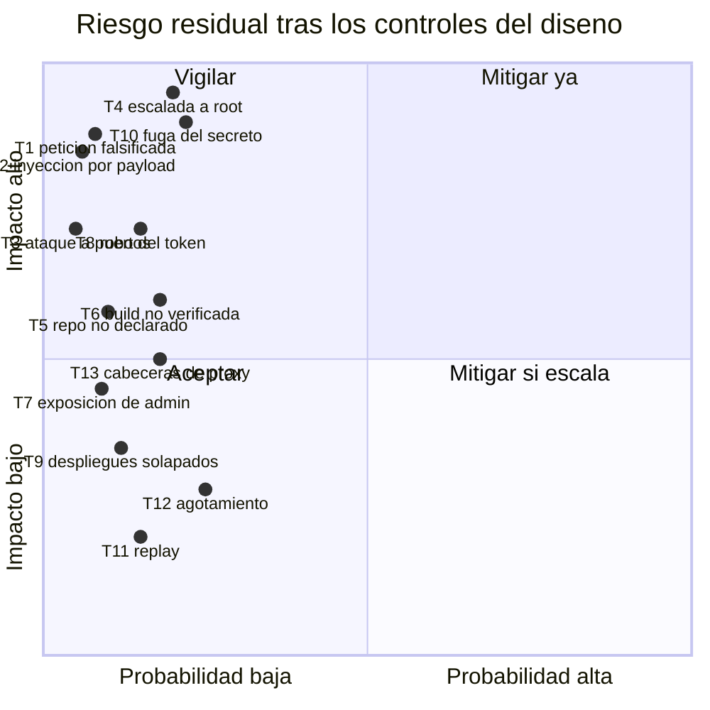

# Threat Model — Receptor de webhooks y cadena de despliegue

* **Estado:** approved
* **Fecha:** 2026-08-31
* **Decisores:** Jeremi Alcala
* **Fase AI-DLC:** 02-design
* **Versión:** 0.5.1
* **Gate:** 1
* **Alcance:** receptor + ingress por túnel + socket-proxy + cadena de suministro de imágenes + estado en disco
* **Metodología:** STRIDE + DREAD
* **Clasificación de datos (ref):** `docs/00-project/data-classification.md`

## Diagrama de flujo de datos (DFD)

*Eje comportamiento — fase 02-design. Insumo del STRIDE. La frontera 4 es la crítica: cruzarla
es alcanzar un daemon que corre como root.*

## Análisis STRIDE

| Componente / flujo | Spoofing | Tampering | Repudiation | Info Disclosure | DoS | Elevation |
|---|---|---|---|---|---|---|
| **Entrada del webhook** (Edge → receptor) | **T1**: petición falsificada haciéndose pasar por GitHub | **T2**: payload manipulado para inyectar rutas o comandos | **T11**: replay de una entrega legítima sin trazar | — | **T12**: cuerpo enorme o avalancha de peticiones | — |
| **Receptor → socket-proxy** | — | — | Acciones sobre Docker sin atribución a una entrega | — | — | **T4**: crear contenedor privilegiado ⇒ root del host |
| **Emparejamiento con el inventario** | **T5**: desplegar un repositorio no declarado | Manipular `apps.yml` si se tiene acceso al host | — | Rutas internas y endpoints de salud | — | — |
| **Endpoints de administración** | — | **T7**: `/reload` releería el inventario | — | **T7**/**T13**: `/status` revela inventario, rutas internas e histórico | T13: recargas repetidas | — |
| **Secreto y credenciales** | **T10**: quien tiene el secreto **es** GitHub para el sistema | — | — | **T10**: fuga por logs, backup o repositorio | — | T10 ⇒ despliegue arbitrario |
| **Túnel** | **T8**: con el token del túnel se publica otro origen | — | — | — | Caída ⇒ sin despliegues | — |
| **Cadena de suministro** (GHCR, PyPI) | Imagen suplantada en el registro | **T6**: desplegar una build no verificada | — | — | — | Dependencia comprometida ⇒ T4 |
| **Puertos del host** | — | — | — | — | **T3**: escaneo y ataque directo | — |
| **Cola de despliegues** | — | **T9**: despliegues solapados dejan estado inconsistente | — | — | — | — |

## Priorización DREAD

Cada dimensión de 1 a 5; puntuación = media. **≥ 4,0 crítica · 3,0–3,9 alta · 2,0–2,9 media ·
< 2,0 baja.** Valores **tras** aplicar los controles del diseño actual.

| ID | Amenaza | D | R | E | A | Di | Score | Nivel | Control (trazable) |
|---|---|---|---|---|---|---|---|---|---|
| **T4** | Escalada a root del host desde el receptor | 5 | 3 | 2 | 5 | 3 | **3,6** | Alta | ADR-0005: socket-proxy; `exec`/`secrets`/`system` cerrados. **No eliminada** |
| **T10** | Fuga del secreto HMAC | 5 | 4 | 2 | 4 | 2 | **3,4** | Alta | `0600 root:root`, fuera del repo, ≥ 32 caracteres forzados en `config.load_settings` |
| **T1** | Petición falsificada | 5 | 1 | 1 | 4 | 5 | **3,2** | Alta | RS01: HMAC-SHA256 con `compare_digest`, validado **antes** de parsear el JSON |
| **T6** | Despliegue de build no verificada | 3 | 4 | 3 | 3 | 3 | **3,2** | Alta | ADR-0002: `workflow_run` + `conclusion: success` + nombre del workflow |
| **T8** | Robo del token del túnel | 4 | 2 | 2 | 4 | 2 | **2,8** | Media | `0600` fuera del repo; rotación documentada en el runbook |
| **T2** | Inyección por payload | 5 | 1 | 1 | 4 | 3 | **2,8** | Media | ADR-0007: `create_subprocess_exec` sin shell; ninguna ruta sale del payload |
| **T5** | Despliegue de repo no declarado | 3 | 2 | 1 | 3 | 4 | **2,6** | Media | ADR-0007: el inventario es la allowlist; emparejamiento en 4 dimensiones |
| **T9** | Despliegues solapados | 2 | 3 | 2 | 3 | 3 | **2,6** | Media | ADR-0008: un worker por app; escritura atómica del estado |
| **T7** | Exposición de `/status` y `/reload` | 3 | 2 | 1 | 2 | 4 | **2,4** | Media | Guardia loopback/token en `main._authorized`. **El filtro por ruta en el borde está diseñado (ADR-0004) pero NO aplicado en el despliegue actual** — ver DS-07 |
| **T13** | Los endpoints de administración quedan expuestos al cambiar el tratamiento de cabeceras de proxy | 3 | 2 | 2 | 3 | 4 | **2,8** | Media | Ninguno propio: hoy dependen de dos comportamientos ajenos. Ver la sección dedicada |
| **T12** | Agotamiento de recursos | 2 | 4 | 3 | 2 | 1 | **2,4** | Media | Límite de 1 MiB antes de parsear; `command_timeout`; cola acotada |
| **T11** | Replay de una entrega | 2 | 3 | 2 | 2 | 2 | **2,2** | Media | Caché LRU de 1024 `X-GitHub-Delivery`; además el redespliegue es idempotente |
| **T3** | Ataque directo a puertos | 4 | 1 | 1 | 4 | 1 | **2,2** | Media | ADR-0004: nada escucha en interfaz pública; `BIND_HOST=127.0.0.1` probado |

*Eje trazabilidad — fase 02-design. Comparar con el cuadrante del PRD: los controles desplazan
casi todo hacia la izquierda (menos probable), pero **el impacto de T4 y T10 no baja**, porque
ninguno de los dos controles reduce lo que ocurre si se materializan.*

## La amenaza que no se cierra: T4

Merece su propia sección porque es la única cuyo control es **parcial y conocido como tal**.

Desplegar contenedores exige `POST /containers/create`. Con ese permiso —lo tenga el grupo
`docker` o un socket-proxy— se puede crear un contenedor privilegiado montando `/`. Por tanto:

- El socket-proxy **reduce la probabilidad** (bloquea `exec`, `secrets`, `swarm`, `system`,
  `build`) y añade un punto único de auditoría. En la tabla eso mueve `E` (explotabilidad) de 4
  a 2 y `R` de 4 a 3.
- El socket-proxy **no reduce el impacto**: `D` y `A` siguen en 5. Quien comprometa el receptor
  sigue pudiendo comprometer el host.

**Docker rootless es la única mitigación que cambia el impacto.** Está registrada como
evolución, no como control vigente. Documentarla como implementada sería falsear el modelo.

Condición de escalado a requisito, ya fijada en ADR-0005: si el receptor pasara a desplegar
aplicaciones de terceros, o apareciera una segunda superficie de entrada.

## T13: una propiedad de seguridad sostenida por accidente

Descubierta el 2026-08-31 al publicar el receptor en `hgtech001` y **comprobar la exposición
real** en vez de darla por buena.

### Lo que se esperaba y lo que hay

ADR-0004 especifica que el túnel publique **solo** `^/webhook$`, de modo que `/status` y
`/reload` no existan desde Internet. El túnel que se desplegó publica **el puerto 9000 entero**
hacia `deploy.higerotech.com`. La primera mitad del control que este documento daba por
aplicada no existe.

Y sin embargo, `/status` y `/reload` **sí** responden `403` desde Internet. La pregunta
relevante no era si estábamos protegidos, sino **por qué**.

### Por qué funciona hoy

Dos comportamientos encadenados, ninguno diseñado por nosotros:

1. **uvicorn trae `--proxy-headers` activo por defecto** y confía en los peers de
   `forwarded_allow_ips` (127.0.0.1). Como el túnel se conecta desde loopback, uvicorn
   **reescribe `request.client` con el `X-Forwarded-For`** entrante. Por eso
   `main._authorized` acaba viendo la IP real del cliente de Internet y no la del túnel.
2. **Cloudflare sobrescribe el `X-Forwarded-For`** que envíe el cliente con la IP real de
   origen, así que no se puede inyectar un valor de loopback desde fuera.

Ambos verificados contra el despliegue real:

| Prueba | Resultado |
|---|---|
| `GET /status` en loopback, sin `X-Forwarded-For` | `200` — el guardia ve `127.0.0.1` |
| `GET /status` en loopback, con `X-Forwarded-For: 203.0.113.7` | **`403`** — uvicorn reescribió el cliente |
| `GET /status` en loopback, con `X-Forwarded-For: 127.0.0.1` | `200` |
| `GET /status` desde Internet | **`403`** |
| Desde Internet con `X-Forwarded-For: 127.0.0.1` | **`403`** |
| Desde Internet con `X-Forwarded-For: ::1` | **`403`** |
| Desde Internet con `X-Forwarded-For: 127.0.0.1, 1.2.3.4` | **`403`** |
| Desde Internet con `X-Forwarded-For: 1.2.3.4, 127.0.0.1` | **`403`** |
| Desde Internet con `X-Real-IP: 127.0.0.1` | **`403`** |
| Desde Internet con `Forwarded: for=127.0.0.1` | **`403`** |
| Desde Internet con `CF-Connecting-IP: 127.0.0.1` | **`403`** |

### Por qué es una amenaza pese a estar protegidos

Porque **el fallo sería silencioso**. Basta con que se rompa cualquiera de los dos eslabones:

- Arrancar uvicorn con `--no-proxy-headers`, o que cambie su valor por defecto en una versión
  futura. Entonces `request.client` vuelve a ser el peer —loopback, el túnel— y
  `main._authorized` **autoriza a cualquiera que llegue por el túnel**.
- Poner delante otro proxy (nginx, Traefik, otro túnel) que no normalice `X-Forwarded-For`, o
  que lo reenvíe tal cual lo manda el cliente.
- Cambiar `forwarded_allow_ips` a `*`, que es una recomendación frecuente en guías de
  despliegue tras proxy.

Ninguno de esos cambios produce un error visible: el sistema sigue desplegando con normalidad
mientras `/status` y `/reload` quedan abiertos a Internet. **Un control que se rompe en
silencio es peor que un control ausente**, porque nadie lo revisa.

No es un fallo de Cloudflare ni de uvicorn: ambos hacen algo razonable. El fallo es nuestro,
por haber dado por aplicado un control (el filtro por ruta) sin comprobarlo, y por acabar
dependiendo de un comportamiento que nunca elegimos.

### Cómo se cierra

Por orden de solidez:

1. **Filtro por ruta en el borde** — lo que ADR-0004 ya especifica. Que solo
   `deploy.higerotech.com/webhook` llegue al receptor y el resto muera con `404` en el Edge.
   Elimina la dependencia por completo: los endpoints no existen desde fuera. Es la corrección
   preferente y no requiere tocar código.
2. **Guardia explícito en el receptor**: exigir `STATUS_TOKEN` siempre que la petición traiga
   cabeceras de reenvío, en lugar de fiarse de la IP resultante. Convierte una propiedad
   accidental en una decisión, y protege aunque el borde se configure mal.
3. **Definir `STATUS_TOKEN`** en `receiver.env`. Mitiga poco por sí solo —el guardia es un
   `OR`, y la vía de loopback seguiría abierta— pero da acceso legítimo desde fuera sin
   depender de la IP.

Mientras 1 y 2 no estén, esta amenaza queda **aceptada con condición de revisión**: cualquier
cambio en el ingress, en el proxy o en los parámetros de arranque de uvicorn obliga a repetir
las pruebas de la tabla de arriba.

## Controles verificados

| Control | Evidencia |
|---|---|
| Firma HMAC validada antes de parsear | `test_security.py` (6 casos de rechazo) + `test_webhook.py::test_rechaza_una_firma_de_otro_secreto` |
| Reentregas deduplicadas | `test_security.py::TestDeliveryCache` (4 casos) + `test_webhook.py::test_la_reentrega_...` |
| Emparejamiento estricto | `test_webhook.py::test_ignora_lo_que_no_esta_declarado` (rama, workflow, repo) |
| Secreto débil rechazado al arrancar | `test_config.py::test_falla_con_un_secreto_corto` |
| Escucha solo en loopback | `test_config.py::test_escucha_en_loopback_por_defecto` |
| Nunca el socket crudo de Docker | `test_config.py::test_apunta_al_socket_proxy_por_defecto` |
| `exec` y `system` bloqueados en el proxy | Verificación manual contra Docker 29.5.2: ambos devuelven `403` |
| Nada sensible en el repositorio | `git ls-files` no lista `.env` ni `config/apps.yml` |
| `/status` y `/reload` rechazados desde Internet | `403` en 7 variantes de suplantación de cabeceras (ver T13) |
| El webhook sí es alcanzable desde Internet | `401 firma invalida` sin firma: la petición llega y se rechaza por el control correcto |
| `deploy` fuera del grupo `docker` en el servidor real | `id -nG deploy` devuelve solo `deploy` |
| Nada escuchando en interfaz pública | `ss -ltn`: `9000` y `2375` solo en `127.0.0.1` |

## Deuda de seguridad reconocida

| ID | Deuda | Riesgo que deja abierto | Destino |
|---|---|---|---|
| **DS-01** | Docker rootless no implementado | T4 conserva impacto total | Evolución; requisito si cambian las condiciones de ADR-0005 |
| **DS-02** | Sin rotación del `.jsonl` de despliegues | Disco lleno ⇒ el receptor deja de registrar | Gate 4 |
| **DS-03** | Sin notificación del resultado del despliegue | Un fallo puede pasar inadvertido (A09) | Gate 4 |
| **DS-04** | Sin procedimiento probado de rotación del secreto | T10 tarda más en cerrarse tras una sospecha | Runbook, Gate 4 |
| ~~**DS-05**~~ | ~~Sin SBOM ni escaneo de dependencias~~ | — | **Cerrada**: `pip-audit` y SBOM CycloneDX en CI (job `sca`) |
| **DS-06** | `health_url` es opcional | Sin ella no hay verificación real ni rollback fiable | Decisión pendiente: hacerla obligatoria en `load_apps` |
| **DS-07** | **El túnel publica el puerto entero, no solo `^/webhook$`** | T13: los endpoints de administración dependen de comportamientos ajenos para no quedar expuestos | Editar la regla de ingress en el dashboard de Cloudflare (el túnel se gestiona por token, no por `config.yml`) |
