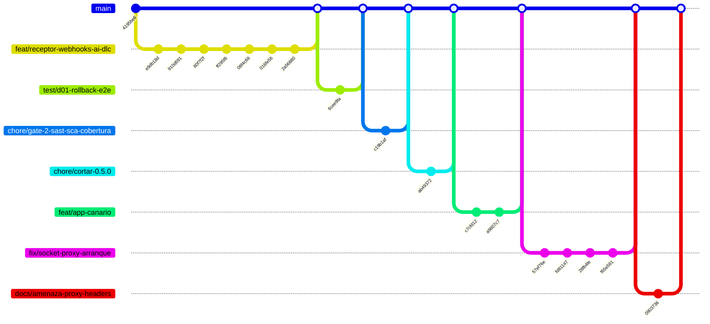

# Historial de implementación — despliegue-continuo

* **Estado:** review
* **Fecha:** 2026-08-31
* **Decisores:** Jeremi Alcala
* **Fase AI-DLC:** 03-implementation
* **Versión:** 0.5.2
* **Gate:** 2
* **Rama principal:** main
* **Estrategia de branching:** trunk-based — el trabajo llega a `main` por pull request, y se
  etiqueta sobre `main`
* **Firma:** todos los commits van firmados con SSH (exigido por el ruleset `Protect-MAIN`)

> Este documento es **generado**. El cuerpo de abajo se deriva de `git log`; al regenerarlo hay
> que volver a anteponer esta cabecera y la tabla de trazabilidad final:
>
> ```bash
> python scripts/gitgraph_from_log.py . --branch main --out docs/03-implementation/repo-history.md
> ```
>
> **Limitación conocida del generador:** decora con `tag:` únicamente los commits de la rama
> que traza. Desde que el trabajo entra por pull request, los commits etiquetados se dibujan
> sobre su rama de origen y **pierden la etiqueta en el grafo**. No se parchea a mano —sería
> dejar de ser documentación derivada—: la correspondencia tag ↔ versión es la tabla de
> trazabilidad del final, que es la fuente autoritativa.

## Historial del repositorio (documentación viva)

Derivado de `git log` con `scripts/gitgraph_from_log.py`. Regenerar tras cada merge o tag para
mantener la traza sincronizada. La correspondencia tag ↔ versión está en la tabla de
trazabilidad, no en el grafo (ver la limitación anotada en la cabecera).

### Grafo de commits y merges



### Bitácora de cambios (fiel al repo)

| Commit | Tipo | Tags | Autor | Fecha | Mensaje |
|---|---|---|---|---|---|
| `83bca98` | commit | — | Jeremi Alcala | 2026-08-31 | docs(seguridad): DS-07 cerrada, T13 mitigada en el borde |
| `cd2f20e` | merge | — | Jeremi J. Alcalá M. | 2026-08-31 | Merge pull request #7 from higerotech/docs/amenaza-proxy-headers |
| `0903736` | commit | — | Jeremi Alcala | 2026-08-31 | docs(seguridad): T13 y DS-07 — el filtro por ruta no estaba aplicado |
| `914fe6c` | merge | — | Jeremi J. Alcalá M. | 2026-08-31 | Merge pull request #6 from higerotech/fix/socket-proxy-arranque |
| `f65e561` | commit | — | Jeremi Alcala | 2026-08-31 | fix: la comprobacion de venv no comprobaba nada |
| `28fb4fe` | commit | — | Jeremi Alcala | 2026-08-31 | fix: un entorno virtual a medias se daba por bueno |
| `fd81147` | commit | — | Jeremi Alcala | 2026-08-31 | fix: comprobar los prerequisitos completos antes de tocar el sistema |
| `57ef76e` | commit | — | Jeremi Alcala | 2026-08-31 | fix: el socket-proxy no arranca con read_only, y el instalador no esperaba |
| `b780b74` | merge | — | Jeremi J. Alcalá M. | 2026-08-31 | Merge pull request #5 from higerotech/feat/app-canario |
| `a9807c7` | commit | — | Jeremi Alcala | 2026-08-31 | fix: install.sh necesita el bit de ejecucion en git |
| `c7cfd12` | commit | — | Jeremi Alcala | 2026-08-31 | feat: aplicacion canario para validar una instalacion nueva |
| `dd1856d` | merge | — | Jeremi J. Alcalá M. | 2026-08-30 | Merge pull request #4 from higerotech/chore/cortar-0.5.0 |
| `ab49372` | commit | v0.5.0 | Jeremi Alcala | 2026-08-30 | docs: corta 0.5.0 — Gate 2 superado |
| `9496034` | merge | — | Jeremi J. Alcalá M. | 2026-08-30 | Merge pull request #3 from higerotech/chore/gate-2-sast-sca-cobertura |
| `c19b1af` | commit | — | Jeremi Alcala | 2026-08-30 | chore: SAST, SCA y cobertura medida — Gate 2 al 4 de 5 |
| `4799057` | merge | — | Jeremi J. Alcalá M. | 2026-08-30 | Merge pull request #2 from higerotech/test/d01-rollback-e2e |
| `6cee9fa` | commit | — | Jeremi Alcala | 2026-08-30 | test: prueba de extremo a extremo del rollback contra Docker real (D-01) |
| `a8b25df` | merge | — | Jeremi J. Alcalá M. | 2026-08-30 | Merge pull request #1 from higerotech/feat/receptor-webhooks-ai-dlc |
| `2a56880` | commit | — | Jeremi Alcala | 2026-08-30 | docs(03): regenera el historial sobre la rama firmada y linealizada |
| `910d691` | commit | v0.1.0 | Jeremi Alcala | 2026-08-30 | docs(00-01): charter, glosario, clasificacion de datos y PRD |
| `80f7f2f` | commit | v0.2.0 | Jeremi Alcala | 2026-08-30 | docs(02): arquitectura C4, threat model STRIDE/DREAD y siete ADRs |
| `ff295f6` | commit | v0.3.0 | Jeremi Alcala | 2026-08-30 | docs(03): runbook de instalacion y operacion |
| `08f4c69` | commit | v0.4.0 | Jeremi Alcala | 2026-08-30 | docs(04): estrategia de pruebas y changelog; Gates 2 y 3 quedan abiertos |
| `016fe56` | commit | — | Jeremi Alcala | 2026-08-30 | docs(03): historial derivado del repo e indice de navegacion |
| `e9db18d` | commit | — | Jeremi Alcala | 2026-08-30 | feat: receptor de webhooks de GitHub para despliegue continuo |
| `4195be6` | commit | — | Jeremi J. Alcalá M. | 2026-08-30 | Initial commit |

## Trazabilidad tag ↔ versión ↔ artefacto

| Tag | Versión | Gate | Estado del gate | Artefactos que introduce |
|---|---|---|---|---|
| `v0.1.0` | 0.1.0 | 0 | **Superado** | `charter.md`, `glossary.md`, `data-classification.md`, PRD, ADR-0001 |
| `v0.2.0` | 0.2.0 | 1 | **Superado** | `architecture.md`, `threat-model.md`, `interfaces-contract.md`, ADR-0002 a ADR-0008 |
| `v0.3.0` | 0.3.0 | 2 | Abierto al cortarse; **superado después en `v0.5.0`** | `deployment-runbook.md`, este documento |
| `v0.4.0` | 0.4.0 | 3 | **Abierto** — quedan matriz OWASP, contrato (D-07), DAST y mutation testing (D-06) | `test-strategy.md`, `CHANGELOG.md` |
| `v0.5.0` | 0.5.0 | 2 | **Superado** — SAST, SCA, cobertura 93,47 % y dual review completo | Suite de 91 pruebas, jobs `sast` y `sca` |

### Notas sobre este historial

- El primer commit del trabajo **precede a toda la documentación**: el código se implementó y
  verificó antes de aplicar AI-DLC. Es la adopción retroactiva que declara
  [ADR-0001](../00-project/adr/0001-adopcion-estructura-ai-dlc.md), y el grafo lo muestra tal
  cual en lugar de disimularlo.
- El repositorio en GitHub se creó con un `LICENSE` mientras el trabajo local avanzaba, de modo
  que ambos historiales nacieron **sin ancestro común**. Se resolvió rebasando sobre
  `Initial commit` al tener que firmar los commits de todos modos.
- A partir de `v0.5.0` el trabajo entra por pull request con los cuatro jobs de CI en verde, de
  ahí los merges que aparecen en el grafo.
- Los commits posteriores a `v0.5.0` corresponden a la **puesta en producción** en `hgtech001`:
  cuatro fallos del instalador que solo aparecieron instalando de verdad, la aplicación canario
  y el hallazgo de seguridad T13.
