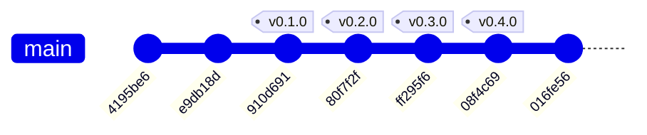

# Historial de implementación — despliegue-continuo

* **Estado:** review
* **Fecha:** 2026-08-30
* **Decisores:** Jeremi Alcala
* **Fase AI-DLC:** 03-implementation
* **Versión:** 0.3.0
* **Gate:** 2
* **Rama principal:** main
* **Estrategia de branching:** trunk-based — el trabajo llega a `main` por pull request, y se
  etiqueta sobre `main`
* **Firma:** todos los commits van firmados con SSH (exigido por el ruleset `Protect-MAIN`)

> Este documento es **generado**. El cuerpo de abajo se deriva de `git log`; al regenerarlo hay
> que volver a anteponer esta cabecera y la tabla de trazabilidad final:
>
> ```bash
> python scripts/gitgraph_from_log.py . --branch main --out docs/03-implementation/repo-history.md
> ```

## Historial del repositorio (documentación viva)

Derivado de `git log` con `scripts/gitgraph_from_log.py`. Regenerar tras cada merge o tag para
mantener la traza sincronizada. Los tags SemVer enlazan con las versiones del `CHANGELOG.md`.

### Grafo de commits y merges



### Bitácora de cambios (fiel al repo)

| Commit | Tipo | Tags | Autor | Fecha | Mensaje |
|---|---|---|---|---|---|
| `016fe56` | commit | — | Jeremi Alcala | 2026-08-30 | docs(03): historial derivado del repo e indice de navegacion |
| `910d691` | commit | v0.1.0 | Jeremi Alcala | 2026-08-30 | docs(00-01): charter, glosario, clasificacion de datos y PRD |
| `80f7f2f` | commit | v0.2.0 | Jeremi Alcala | 2026-08-30 | docs(02): arquitectura C4, threat model STRIDE/DREAD y siete ADRs |
| `ff295f6` | commit | v0.3.0 | Jeremi Alcala | 2026-08-30 | docs(03): runbook de instalacion y operacion |
| `08f4c69` | commit | v0.4.0 | Jeremi Alcala | 2026-08-30 | docs(04): estrategia de pruebas y changelog; Gates 2 y 3 quedan abiertos |
| `e9db18d` | commit | — | Jeremi Alcala | 2026-08-30 | feat: receptor de webhooks de GitHub para despliegue continuo |
| `5fd0c4c` | commit | — | Jeremi Alcala | 2026-08-30 | docs(03): historial derivado del repo e indice de navegacion |
| `b11b52c` | merge | — | Jeremi Alcala | 2026-08-30 | merge: incorpora el LICENSE del repositorio remoto |
| `55227f9` | commit | — | Jeremi Alcala | 2026-08-30 | docs(04): estrategia de pruebas y changelog; Gates 2 y 3 quedan abiertos |
| `3e1a036` | commit | — | Jeremi Alcala | 2026-08-30 | docs(03): runbook de instalacion y operacion |
| `852ba76` | commit | — | Jeremi Alcala | 2026-08-30 | docs(02): arquitectura C4, threat model STRIDE/DREAD y siete ADRs |
| `601c6db` | commit | — | Jeremi Alcala | 2026-08-30 | docs(00-01): charter, glosario, clasificacion de datos y PRD |
| `83bf2ca` | commit | — | Jeremi Alcala | 2026-08-30 | feat: receptor de webhooks de GitHub para despliegue continuo |
| `4195be6` | commit | — | Jeremi J. Alcalá M. | 2026-08-30 | Initial commit |

## Trazabilidad tag ↔ versión ↔ artefacto

| Tag | Versión | Gate | Estado del gate | Artefactos que introduce |
|---|---|---|---|---|
| `v0.1.0` | 0.1.0 | 0 | **Superado** | `charter.md`, `glossary.md`, `data-classification.md`, PRD `despliegue-continuo-webhook.md`, ADR-0001 |
| `v0.2.0` | 0.2.0 | 1 | **Superado** | `architecture.md`, `threat-model.md`, `interfaces-contract.md`, ADR-0002 a ADR-0008 |
| `v0.3.0` | 0.3.0 | 2 | Abierto al cortarse; **superado después en `v0.5.0`** | `deployment-runbook.md`, este documento |
| `v0.4.0` | 0.4.0 | 3 | **Abierto** — quedan matriz OWASP, contrato (D-07), DAST y mutation testing (D-06) | `test-strategy.md`, `CHANGELOG.md` |
| `v0.5.0` | 0.5.0 | 2 | **Superado** — SAST, SCA, cobertura 93,47 % y dual review completo | `test_rollback_e2e.py`, `test_deployer.py`, `test_queue.py`, `test_admin.py`, jobs `sast` y `sca` |

### Notas sobre este historial

- El primer commit del trabajo **precede a toda la documentación**: el código se implementó y
  verificó antes de aplicar AI-DLC. Es la adopción retroactiva que declara
  [ADR-0001](../00-project/adr/0001-adopcion-estructura-ai-dlc.md), y el grafo lo muestra tal
  cual en lugar de disimularlo.
- El repositorio en GitHub se creó con un `LICENSE` (Apache 2.0) mientras el trabajo local
  avanzaba, de modo que ambos historiales nacieron **sin ancestro común**. Se resolvió primero
  con un merge explícito; al exigir el ruleset `Protect-MAIN` commits firmados, hubo que
  reescribirlos de todos modos para firmarlos, y se aprovechó para **rebasar sobre
  `Initial commit`**. El resultado es la historia lineal de arriba, sin merge de conveniencia.
- Las cuatro versiones se cortan el mismo día; el motivo está en la nota de cabecera del
  `CHANGELOG.md`.
