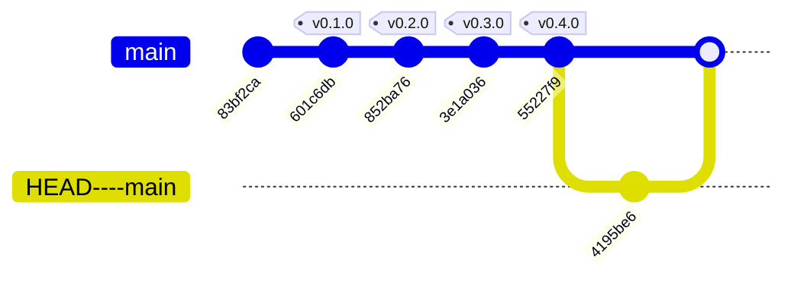

# Historial de implementación — despliegue-continuo

* **Estado:** review
* **Fecha:** 2026-08-30
* **Decisores:** Jeremi Alcala
* **Fase AI-DLC:** 03-implementation
* **Versión:** 0.3.0
* **Gate:** 2
* **Rama principal:** main
* **Estrategia de branching:** trunk-based — se etiqueta en `main`, sin ramas de release

> Este documento es **generado**. El cuerpo de abajo se deriva de `git log`; al regenerarlo hay
> que volver a anteponer esta cabecera y la tabla de trazabilidad final:
>
> ```bash
> python scripts/gitgraph_from_log.py . --branch main --out docs/03-implementation/repo-history.md
> ```

## Historial del repositorio (documentación viva)

Derivado de `git log` con `scripts/gitgraph_from_log.py`. Regenerar tras cada merge o tag para
mantener la traza sincronizada. Los tags SemVer enlazan con las versiones del `CHANGELOG.md`.

### Grafo de commits y merges



### Bitácora de cambios (fiel al repo)

| Commit | Tipo | Tags | Autor | Fecha | Mensaje |
|---|---|---|---|---|---|
| `b11b52c` | merge | — | Jeremi Alcala | 2026-08-30 | merge: incorpora el LICENSE del repositorio remoto |
| `3e1a036` | commit | v0.3.0 | Jeremi Alcala | 2026-08-30 | docs(03): runbook de instalacion y operacion |
| `55227f9` | commit | v0.4.0 | Jeremi Alcala | 2026-08-30 | docs(04): estrategia de pruebas y changelog; Gates 2 y 3 quedan abiertos |
| `601c6db` | commit | v0.1.0 | Jeremi Alcala | 2026-08-30 | docs(00-01): charter, glosario, clasificacion de datos y PRD |
| `852ba76` | commit | v0.2.0 | Jeremi Alcala | 2026-08-30 | docs(02): arquitectura C4, threat model STRIDE/DREAD y siete ADRs |
| `83bf2ca` | commit | — | Jeremi Alcala | 2026-08-30 | feat: receptor de webhooks de GitHub para despliegue continuo |
| `4195be6` | commit | — | Jeremi J. Alcalá M. | 2026-08-30 | Initial commit |

## Trazabilidad tag ↔ versión ↔ artefacto

| Tag | Versión | Gate | Estado del gate | Artefactos que introduce |
|---|---|---|---|---|
| `v0.1.0` | 0.1.0 | 0 | **Superado** | `charter.md`, `glossary.md`, `data-classification.md`, PRD `despliegue-continuo-webhook.md`, ADR-0001 |
| `v0.2.0` | 0.2.0 | 1 | **Superado** | `architecture.md`, `threat-model.md`, `interfaces-contract.md`, ADR-0002 a ADR-0008 |
| `v0.3.0` | 0.3.0 | 2 | **Abierto** — faltan SAST, SCA/SBOM, cobertura y revisión humana | `deployment-runbook.md`, este documento |
| `v0.4.0` | 0.4.0 | 3 | **Abierto** — faltan e2e (D-01), matriz OWASP, DAST y mutation testing | `test-strategy.md`, `CHANGELOG.md` |

### Notas sobre este historial

- El commit `83bf2ca` **precede a toda la documentación**: el código se implementó y verificó
  antes de aplicar AI-DLC. Es la adopción retroactiva que declara [ADR-0001](../00-project/adr/0001-adopcion-estructura-ai-dlc.md),
  y el grafo lo muestra tal cual en lugar de disimularlo.
- El merge `b11b52c` une dos historiales **sin ancestro común**: el repositorio en GitHub se
  creó con un `LICENSE` (Apache 2.0) mientras el trabajo local avanzaba. Se resolvió con un
  merge explícito para no reescribir commits ya etiquetados.
- Las cuatro versiones se cortan el mismo día; el motivo está en la nota de cabecera del
  `CHANGELOG.md`.
