# Estrategia de pruebas

* **Estado:** approved
* **Fecha:** 2026-08-30
* **Decisores:** Jeremi Alcala
* **Fase AI-DLC:** 04-testing
* **Versión:** 0.4.1
* **Gate:** 3
* **Alcance:** receptor (`receiver/`), ciclo de despliegue contra Docker real y verificación manual de la superficie del socket-proxy
* **Estado de la suite:** **59 pruebas, todas en verde** — 53 rápidas (0,8 s) + 6 de extremo a extremo contra Docker (2 min 20 s)

## Principio

El sistema tiene **un punto cuya corrección sostiene todo lo demás**: la verificación de la
firma. Si falla, ningún otro control importa. Por eso la suite no busca cobertura uniforme,
sino **densidad donde el fallo es catastrófico** y confianza razonable en el resto.

El segundo punto crítico no es de seguridad sino de disponibilidad: **el rollback**. Es lo que
convierte una build rota en un incidente menor en vez de un servicio caído. Durante un tiempo
fue la deuda D-01, verificado solo a mano; ahora tiene pruebas contra Docker real.

## Reparto actual

| Fichero | Pruebas | Qué protege | Nivel |
|---|---|---|---|
| `test_security.py` | 14 | Firma HMAC y deduplicación de entregas | Unitario |
| `test_events.py` | 15 | Traducción de payloads a intención de despliegue | Unitario |
| `test_config.py` | 15 | Arranque seguro y validación del inventario | Unitario |
| `test_webhook.py` | 9 | Endpoint completo con el despliegue sustituido | Integración |
| `test_rollback_e2e.py` | 6 | Ciclo real: `pull`, `up -d`, healthcheck y rollback | **Extremo a extremo** |
| **Total** | **59** | | |

Las de extremo a extremo llevan el marcador `docker` y **se saltan solas** si no hay un daemon
en marcha, de modo que `pytest` sigue siendo útil en una máquina sin Docker:

```bash
pytest                    # todo (necesita Docker para las 6 e2e)
pytest -m "not docker"    # solo las 53 rápidas
pytest -m docker          # solo el ciclo real
```

## Cómo se prueba el rollback de verdad

El obstáculo no era escribir la aserción, sino construir un despliegue que **arranque y falle el
healthcheck**, con una imagen parametrizada únicamente por el tag. La solución son dos tags
locales sobre un mismo repositorio de imagen:

| Tag | Imagen real | Comportamiento |
|---|---|---|
| `sha-sano` | `traefik/whoami:v1.10` | Sirve HTTP en el puerto 80 |
| `sha-sano2` | `traefik/whoami:v1.10` | Igual; sirve para encadenar dos despliegues buenos |
| `sha-roto` | `alpine:3.20` | Arranca y termina de inmediato: nadie responde |

Se crean con `docker tag` desde imágenes públicas, y el compose de la prueba lleva
`pull_policy: never` para que `docker compose pull` no vaya al registro a por un repositorio
que solo existe en local. Cada prueba usa su propio proyecto compose y un puerto libre, y
derriba lo suyo al terminar.

## Qué verifica cada requisito

```mermaid
requirementDiagram
    requirement RS01 {
      id: RS01
      text: Solo se procesan peticiones firmadas
      risk: high
      verifymethod: test
    }
    requirement RS02 {
      id: RS02
      text: Una reentrega no vuelve a desplegar
      risk: medium
      verifymethod: test
    }
    requirement RS04 {
      id: RS04
      text: Sin acceso irrestricto al daemon Docker
      risk: high
      verifymethod: demonstration
    }
    requirement RS05 {
      id: RS05
      text: Ningun secreto llega al repositorio
      risk: high
      verifymethod: inspection
    }
    requirement RF02 {
      id: RF02
      text: No se despliega build fallida ni rama ajena
      risk: high
      verifymethod: test
    }
    requirement RF05 {
      id: RF05
      text: Rollback automatico al fallar el healthcheck
      risk: medium
      verifymethod: test
    }
    requirement RNF01 {
      id: RNF01
      text: Nada escucha en interfaz publica
      risk: high
      verifymethod: test
    }

    element TestSecurity {
      type: "prueba"
    }
    element TestEvents {
      type: "prueba"
    }
    element TestConfig {
      type: "prueba"
    }
    element TestWebhook {
      type: "prueba"
    }
    element TestRollbackE2E {
      type: "prueba"
    }
    element PruebaManualProxy {
      type: "prueba"
    }
    element RevisionGitLsFiles {
      type: "inspeccion"
    }

    TestSecurity - verifies -> RS01
    TestWebhook - verifies -> RS01
    TestSecurity - verifies -> RS02
    TestWebhook - verifies -> RS02
    TestEvents - verifies -> RF02
    TestWebhook - verifies -> RF02
    TestConfig - verifies -> RNF01
    TestRollbackE2E - verifies -> RF05
    PruebaManualProxy - verifies -> RS04
    RevisionGitLsFiles - verifies -> RS05
```



*Eje trazabilidad — fase 04-testing. RS04 es el único que se apoya en demostración manual, y por
un motivo de fondo: comprobar que `exec` está bloqueado exige un daemon con el proxy delante.*

## Cobertura de las transiciones de estado

Contrastado con el `stateDiagram-v2` de `docs/02-design/architecture.md`:

| Transición | Cubierta por | Nivel |
|---|---|---|
| Recibido → Rechazado (firma) | `test_webhook.py::test_rechaza_una_firma_de_otro_secreto`, `test_rechaza_una_peticion_sin_firma` | Automático |
| Recibido → Ignorado (reentrega) | `test_webhook.py::test_la_reentrega_del_mismo_delivery_no_despliega_dos_veces` | Automático |
| Recibido → Ignorado (rama/workflow/repo) | `test_webhook.py::test_ignora_lo_que_no_esta_declarado` (3 casos) | Automático |
| Recibido → Ignorado (build fallida) | `test_events.py::test_no_despliega_si_el_workflow_no_tuvo_exito` (4 casos) | Automático |
| Recibido → Ignorado (ping, tags, borrado de rama) | `test_events.py` (7 casos) | Automático |
| Recibido → Encolado | `test_webhook.py::test_encola_el_despliegue_cuando_todo_encaja` | Automático |
| Desplegando → Verificando → **Vivo** | `test_rollback_e2e.py::test_el_despliegue_sano_deja_el_servicio_respondiendo` | **Automático** |
| Verificando → Fallido → **Revirtiendo → Revertido** | `test_rollback_e2e.py::test_el_rollback_restaura_la_version_anterior` | **Automático** |
| Fallido → **Detenido** (sin tag anterior) | `test_rollback_e2e.py::test_sin_version_anterior_no_hay_rollback` | **Automático** |
| Encolado → Desplegando → Fallido (error de `pull`) | Humo con GHCR real: `pull` denegado, error capturado y registrado | Manual |

Solo queda una transición sin automatizar, y es la menos interesante: el fallo de `pull` ya está
cubierto indirectamente por el mismo camino de error.

## La prueba tiene dientes

Una prueba que pasa solo vale si **falla cuando el código se rompe**. Se comprobó con una
mutación dirigida al camino crítico: desactivar la condición de rollback en `deployer.deploy`.

| Mutación | Resultado |
|---|---|
| `if False and app.rollback and ...` | **2 pruebas fallan**: `test_el_rollback_restaura_la_version_anterior` y `test_el_fallo_queda_registrado_en_el_jsonl` |

`test_el_estado_en_disco_no_avanza_al_tag_roto` siguió pasando, y es correcto: comprueba una
propiedad distinta —que un despliegue fallido nunca se persista como versión viva— que no
depende de que el rollback ocurra.

No es mutation testing sistemático (deuda D-06), pero cubre el punto que importa.

## Verificaciones manuales ejecutadas

Registradas aquí porque respaldan requisitos que ninguna prueba automática cubre.

### Superficie del socket-proxy (RS04) — Docker 29.5.2

| Comprobación | Esperado | Resultado |
|---|---|---|
| `docker compose pull` a través del proxy | Funciona | ✅ |
| `docker compose up -d` a través del proxy | Funciona, app responde `200` | ✅ |
| Recreado con otro tag (ruta de rollback) | Funciona; `docker inspect` confirma | ✅ |
| `docker exec` | Bloqueado | ✅ `403` |
| `docker system df` | Bloqueado | ✅ `403` |

### Endpoint en ejecución real

| Caso | Esperado | Resultado |
|---|---|---|
| `GET /health` | `{"status":"ok"}` | ✅ |
| Firma inválida | `401` | ✅ |
| Rama no desplegable | `202 ignored` con motivo | ✅ |
| Firma válida | `202 queued`, `tag sha-1a2b3c4` | ✅ |
| Reentrega | `202 ignored: ya procesado` | ✅ |
| `POST /reload` | `{"status":"reloaded"}` | ✅ |

## Deuda de pruebas

| ID | Deuda | Riesgo | Cómo se cerraría |
|---|---|---|---|
| ~~**D-01**~~ | ~~RF05 sin prueba e2e~~ | — | **Cerrada** por `test_rollback_e2e.py`, verificada por mutación |
| **D-02** | `deployer.py` sin pruebas unitarias | Las e2e cubren el camino feliz y el rollback, pero no los bordes: timeouts, `health_url` ausente, estado corrupto | Sustituir `_run` por un doble y probar las ramas sin Docker |
| **D-03** | Sin prueba de concurrencia | La serialización por app está razonada pero no demostrada | Encolar N trabajos de la misma app y verificar el orden |
| **D-04** | Sin escaneo de dependencias ni SBOM | Cadena de suministro sin verificar (A03, DS-05) | `pip-audit` en el workflow `ci` |
| **D-05** | Cobertura no medida | No se sabe qué ramas quedan sin ejecutar | `pytest --cov` con umbral en CI |
| **D-06** | Mutation testing no sistemático | Solo se mutó el camino del rollback, a mano | `mutmut` sobre `app/`, objetivo ≥ 60 % |

## Riesgo conocido de las pruebas e2e

Descargan `traefik/whoami` y `alpine` de Docker Hub, cuyo plan gratuito limita a **10 `pull` por
hora sin autenticar**. Los runners de GitHub Actions comparten direcciones IP, así que un pico
de actividad ajena podría hacer fallar el job `test-e2e` con un `429` que no tiene nada que ver
con nuestro código.

No se ha mitigado a propósito: hacerlo exigiría replicar las imágenes a GHCR o autenticar contra
Docker Hub, y ambas cosas cuestan más de lo que hoy vale el problema. **Si el job empieza a
fallar de forma intermitente, esta es la primera causa a descartar**, no un fallo real.

## Ejecución

```bash
cd receiver
python -m venv .venv && ./.venv/bin/pip install -r requirements-dev.txt
./.venv/bin/pytest -q                  # todo
./.venv/bin/pytest -q -m "not docker"  # solo las rápidas
```

En CI (`.github/workflows/ci.yml`) van en **dos jobs separados**: `test` da señal en segundos y
`test-e2e` ejecuta el ciclo contra Docker. La separación evita que un fallo trivial tarde tres
minutos en aparecer.

## Prueba manual de extremo a extremo del webhook

Para validar la cadena completa sin esperar a un push real, firmando como lo haría GitHub:

```bash
BODY='{"action":"completed","workflow_run":{"head_branch":"main","head_sha":"1a2b3c4d5e6f78901234567890abcdef12345678","conclusion":"success","name":"build"},"repository":{"full_name":"higerotech/mi-api"}}'
SIG=$(printf '%s' "$BODY" | openssl dgst -sha256 -hmac "$WEBHOOK_SECRET" | awk '{print $2}')
curl -si http://127.0.0.1:9000/webhook \
  -H "X-GitHub-Event: workflow_run" \
  -H "X-GitHub-Delivery: $(uuidgen)" \
  -H "X-Hub-Signature-256: sha256=$SIG" \
  -H 'Content-Type: application/json' \
  -d "$BODY"
```
