# Estrategia de pruebas

* **Estado:** approved
* **Fecha:** 2026-08-30
* **Decisores:** Jeremi Alcala
* **Fase AI-DLC:** 04-testing
* **Versión:** 0.4.0
* **Gate:** 3
* **Alcance:** receptor (`receiver/`) y verificación manual de la superficie del socket-proxy
* **Estado de la suite:** **52 pruebas, todas en verde** (`pytest -q`, 0,5 s)

## Principio

El sistema tiene **un punto cuya corrección sostiene todo lo demás**: la verificación de la
firma. Si falla, ningún otro control importa. Por eso la suite no busca cobertura uniforme,
sino **densidad donde el fallo es catastrófico** y confianza razonable en el resto.

Consecuencia visible: `security.py` son 70 líneas y tiene 14 pruebas; `deployer.py` son 220
líneas y no tiene ninguna automática. No es un descuido, es la deuda **D-01**, y está razonada
más abajo.

## Reparto actual

| Fichero | Pruebas | Qué protege | Nivel |
|---|---|---|---|
| `test_security.py` | 14 | Firma HMAC y deduplicación de entregas | Unitario |
| `test_events.py` | 15 | Traducción de payloads a intención de despliegue | Unitario |
| `test_config.py` | 14 | Arranque seguro y validación del inventario | Unitario |
| `test_webhook.py` | 9 | Endpoint completo con el despliegue sustituido | Integración |
| **Total** | **52** | | |

Código: 812 líneas en `app/`, 368 en `tests/`. Ratio de prueba ≈ 0,45:1.

## Qué verifica cada requisito

```mermaid
requirementDiagram
    requirement RS01 {
      id: RS01
      text: Solo se procesan peticiones firmadas
      risk: high
      verifymethod: test
    }
    requirement RS02 {
      id: RS02
      text: Una reentrega no vuelve a desplegar
      risk: medium
      verifymethod: test
    }
    requirement RS04 {
      id: RS04
      text: Sin acceso irrestricto al daemon Docker
      risk: high
      verifymethod: demonstration
    }
    requirement RS05 {
      id: RS05
      text: Ningun secreto llega al repositorio
      risk: high
      verifymethod: inspection
    }
    requirement RF02 {
      id: RF02
      text: No se despliega build fallida ni rama ajena
      risk: high
      verifymethod: test
    }
    requirement RF05 {
      id: RF05
      text: Rollback automatico al fallar el healthcheck
      risk: medium
      verifymethod: demonstration
    }
    requirement RNF01 {
      id: RNF01
      text: Nada escucha en interfaz publica
      risk: high
      verifymethod: test
    }

    element TestSecurity {
      type: "prueba"
    }
    element TestEvents {
      type: "prueba"
    }
    element TestConfig {
      type: "prueba"
    }
    element TestWebhook {
      type: "prueba"
    }
    element PruebaManualProxy {
      type: "prueba"
    }
    element RevisionGitLsFiles {
      type: "inspeccion"
    }
    element PendienteRollback {
      type: "deuda"
    }

    TestSecurity - verifies -> RS01
    TestWebhook - verifies -> RS01
    TestSecurity - verifies -> RS02
    TestWebhook - verifies -> RS02
    TestEvents - verifies -> RF02
    TestWebhook - verifies -> RF02
    TestConfig - verifies -> RNF01
    PruebaManualProxy - verifies -> RS04
    RevisionGitLsFiles - verifies -> RS05
    PendienteRollback - verifies -> RF05
```



*Eje trazabilidad — fase 04-testing. `PendienteRollback` es deuda declarada, no una prueba
existente: RF05 hoy solo está verificado a mano.*

## Cobertura de las transiciones de estado

Contrastado con el `stateDiagram-v2` de `docs/02-design/architecture.md`:

| Transición | Cubierta por | Nivel |
|---|---|---|
| Recibido → Rechazado (firma) | `test_webhook.py::test_rechaza_una_firma_de_otro_secreto`, `test_rechaza_una_peticion_sin_firma` | Automático |
| Recibido → Ignorado (reentrega) | `test_webhook.py::test_la_reentrega_del_mismo_delivery_no_despliega_dos_veces` | Automático |
| Recibido → Ignorado (rama/workflow/repo) | `test_webhook.py::test_ignora_lo_que_no_esta_declarado` (3 casos) | Automático |
| Recibido → Ignorado (build fallida) | `test_events.py::test_no_despliega_si_el_workflow_no_tuvo_exito` (4 casos) | Automático |
| Recibido → Ignorado (ping, tags, borrado de rama) | `test_events.py` (7 casos) | Automático |
| Recibido → Encolado | `test_webhook.py::test_encola_el_despliegue_cuando_todo_encaja` | Automático |
| Encolado → Desplegando → Fallido | Humo con GHCR real: `pull` denegado, error capturado y registrado | Manual |
| Desplegando → Verificando → Vivo | Verificado a través del socket-proxy con `traefik/whoami`: `HTTP 200` | Manual |
| Verificando → Fallido → Revirtiendo → Revertido | **No verificado de extremo a extremo** — deuda **D-01** | Pendiente |
| Fallido → Detenido (sin tag anterior) | Humo: primer despliegue fallido, `rolled_back: false` | Manual |

## Verificaciones manuales ejecutadas

Registradas aquí porque respaldan requisitos que ninguna prueba automática cubre.

### Superficie del socket-proxy (RS04) — Docker 29.5.2

| Comprobación | Esperado | Resultado |
|---|---|---|
| `docker compose pull` a través del proxy | Funciona | ✅ |
| `docker compose up -d` a través del proxy | Funciona, app responde `200` | ✅ |
| Recreado con otro tag (ruta de rollback) | Funciona; `docker inspect` confirma | ✅ |
| `docker exec` | Bloqueado | ✅ `403` |
| `docker system df` | Bloqueado | ✅ `403` |

### Endpoint en ejecución real

| Caso | Esperado | Resultado |
|---|---|---|
| `GET /health` | `{"status":"ok"}` | ✅ |
| Firma inválida | `401` | ✅ |
| Rama no desplegable | `202 ignored` con motivo | ✅ |
| Firma válida | `202 queued`, `tag sha-1a2b3c4` | ✅ |
| Reentrega | `202 ignored: ya procesado` | ✅ |
| `POST /reload` | `{"status":"reloaded"}` | ✅ |
| Despliegue con imagen inexistente | Error capturado y escrito en el `.jsonl` | ✅ |

## Deuda de pruebas

| ID | Deuda | Riesgo | Cómo se cerraría |
|---|---|---|---|
| **D-01** | **RF05 (rollback) sin prueba automática de extremo a extremo** | Es el control que evita que una build rota deje el servicio caído, y solo está probado a mano. Un fallo aquí solo se descubre durante un incidente | Prueba de integración con Docker: desplegar una imagen sana, luego una que no arranca, y afirmar que el contenedor vuelve al tag anterior. Requiere Docker en CI |
| **D-02** | `deployer.py` sin pruebas unitarias | Healthcheck, timeouts y escritura de estado sin red de seguridad | Sustituir `_run` por un doble y probar las ramas de `deploy()` sin Docker |
| **D-03** | Sin prueba de carga ni de concurrencia | La serialización por app está razonada pero no demostrada | Encolar N trabajos de la misma app y verificar el orden |
| **D-04** | Sin escaneo de dependencias ni SBOM | Cadena de suministro sin verificar (A03, DS-05) | `pip-audit` en el workflow `ci` |
| **D-05** | Cobertura no medida | No se sabe qué ramas quedan sin ejecutar | `pytest --cov` con umbral en CI |

**D-01 es la que importa.** Las demás son higiene; esa protege el requisito que convierte un
despliegue fallido en un incidente menor en vez de una caída.

## Ejecución

```bash
cd receiver
python -m venv .venv && ./.venv/bin/pip install -r requirements-dev.txt
./.venv/bin/pytest -q
```

En CI: `.github/workflows/ci.yml` corre la suite en cada push y pull request sobre Python 3.12.

## Prueba manual de extremo a extremo

Para validar la cadena completa sin esperar a un push real, firmando como lo haría GitHub:

```bash
BODY='{"action":"completed","workflow_run":{"head_branch":"main","head_sha":"1a2b3c4d5e6f78901234567890abcdef12345678","conclusion":"success","name":"build"},"repository":{"full_name":"higerotech/mi-api"}}'
SIG=$(printf '%s' "$BODY" | openssl dgst -sha256 -hmac "$WEBHOOK_SECRET" | awk '{print $2}')
curl -si http://127.0.0.1:9000/webhook \
  -H "X-GitHub-Event: workflow_run" \
  -H "X-GitHub-Delivery: $(uuidgen)" \
  -H "X-Hub-Signature-256: sha256=$SIG" \
  -H 'Content-Type: application/json' \
  -d "$BODY"
```
